# Engineering Mathematics Final Project (MATLAB)

This repository contains my final project for Engineering Mathematics, implemented entirely in MATLAB.

The project applies core mathematical concepts to computational modeling, including:

- Fourier series signal reconstruction
- Noise analysis and spectral approximation
- Manual 2D Discrete Fourier Transform (DFT)
- Frequency-domain image compression
- Numerical solution of the heat equation (1D and spherical)

---

# Project 1 – Fourier Series & Signal Reconstruction

### Overview

In this section, I:

- Generated a square wave signal
- Approximated it using Fourier series (odd harmonics)
- Visualized convergence behavior for increasing N
- Added Gaussian noise with different variances
- Reconstructed noisy signals using full Fourier coefficient estimation (a₀, aₙ, bₙ)
- Computed Fourier coefficients numerically using trapezoidal integration

### Key Concepts Demonstrated

- Fourier series expansion
- Harmonic approximation
- Gibbs phenomenon
- Noise impact on signal reconstruction
- Numerical integration using `trapz`

### Screenshots

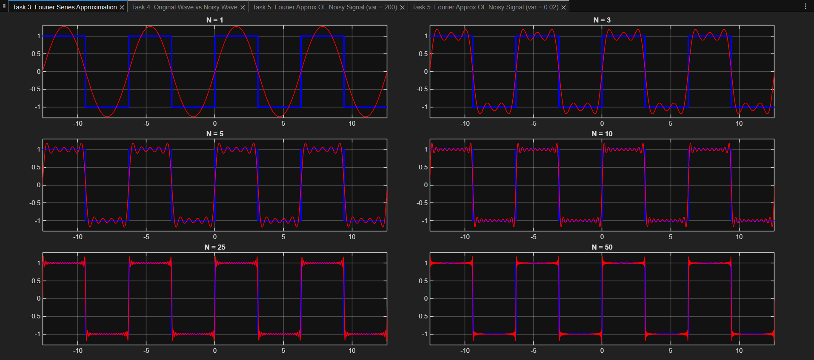
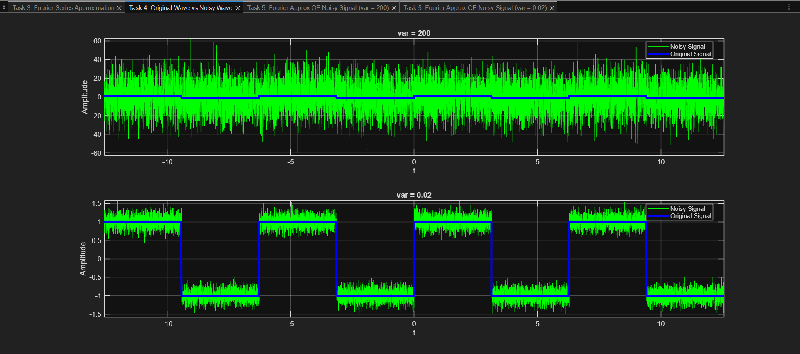
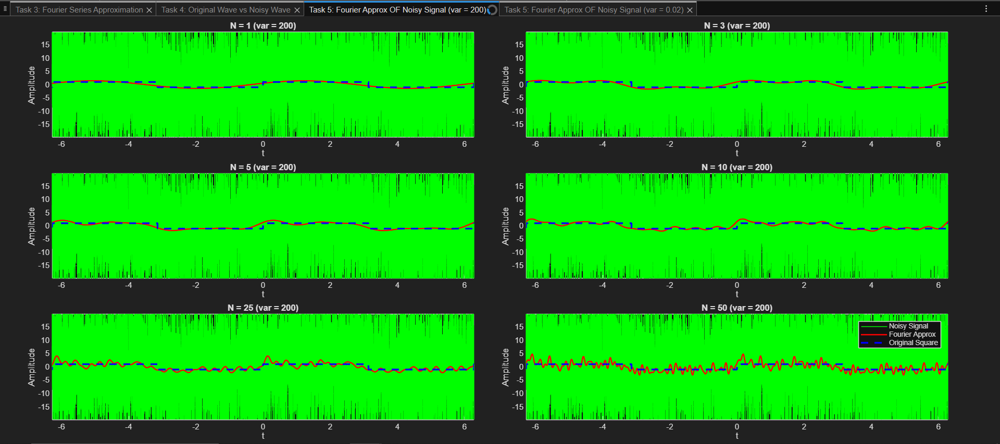
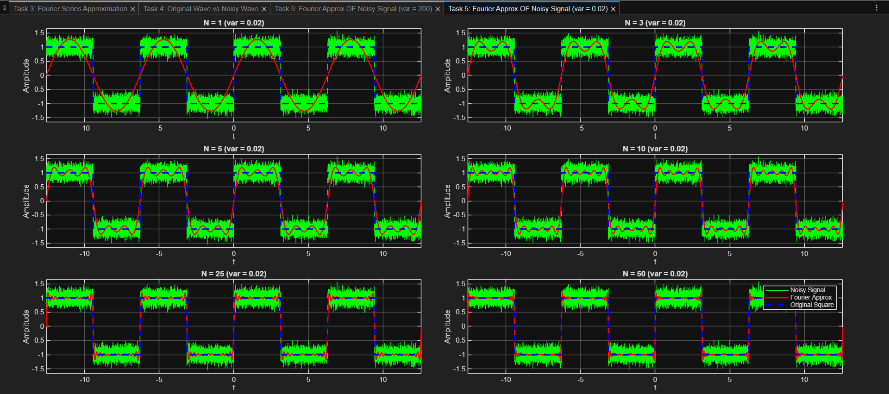

---

# Project 2 – 2D Fourier Transform & Image Compression

### Overview

This section explores frequency-domain representation of images.

Implemented:

- Image preprocessing (grayscale conversion, resizing, normalization)
- 2D FFT using MATLAB built-in `fft2`
- Manual implementation of the full 2D DFT using nested loops
- Manual inverse 2D DFT
- Frequency-domain compression by keeping central spectral coefficients
- Reconstruction comparison at different compression levels

### Key Concepts Demonstrated

- Discrete Fourier Transform (DFT)
- FFT vs manual DFT implementation
- Spectral energy concentration
- Frequency-domain filtering
- Image compression using coefficient truncation

### Screenshots

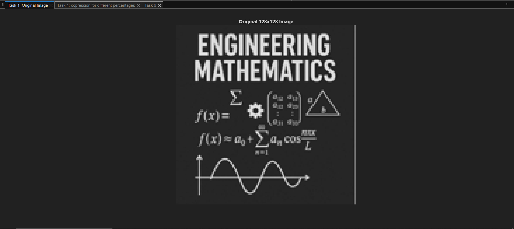
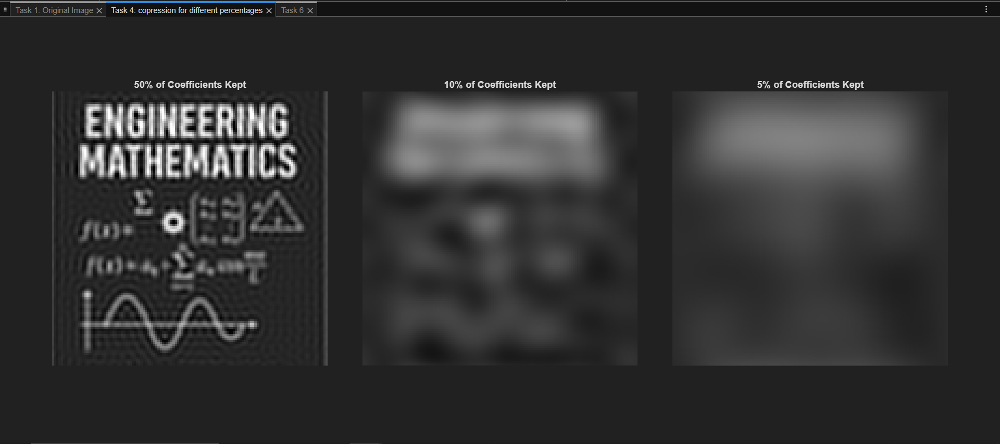
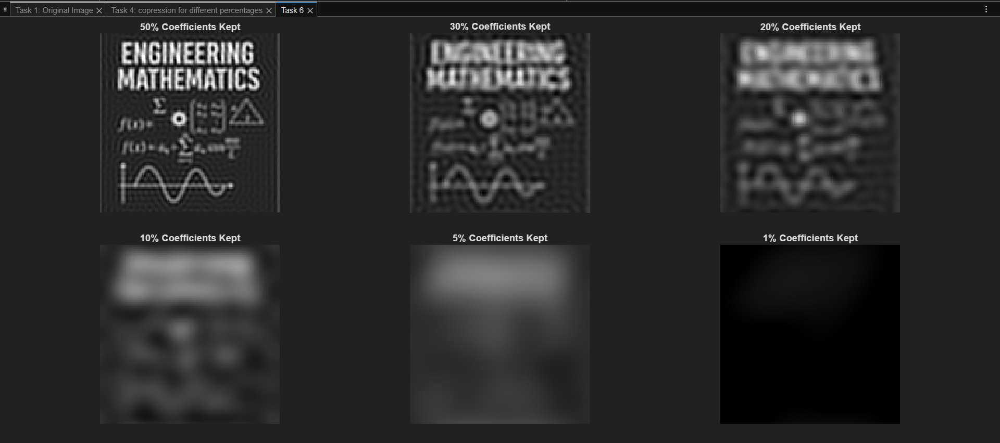

---

# Project 3 – Heat Equation Simulation

### Overview

Numerical solution of time-dependent heat equations using MATLAB's `pdepe` solver.

Implemented:

- Spherical heat diffusion (radial symmetry, m = 2)
- 1D rod heat diffusion (m = 0)
- Temperature evolution over time
- Steady-state approximation
- Boundary and initial condition modeling

### Key Concepts Demonstrated

- Partial Differential Equations (PDEs)
- Heat diffusion modeling
- Radial symmetry
- Numerical PDE solving
- Time-dependent simulation

### Screenshots

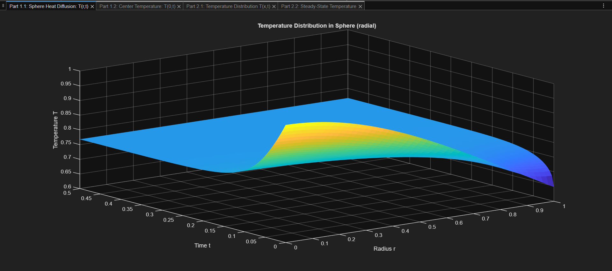
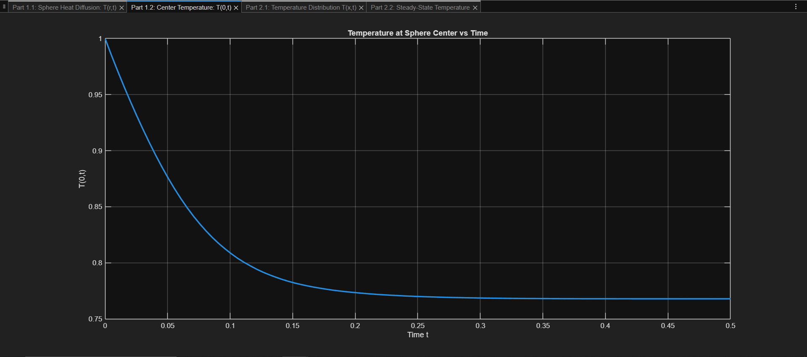
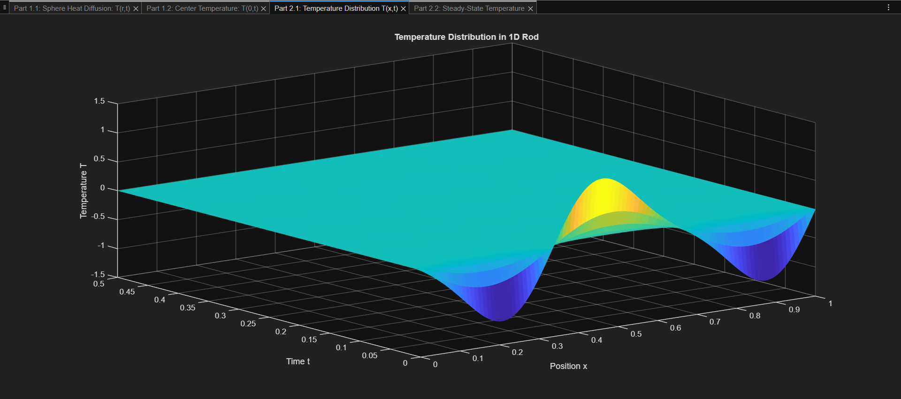
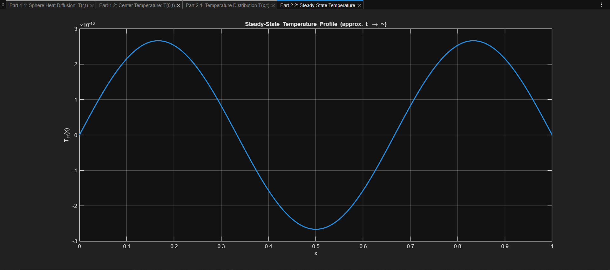

---

# Technologies Used

- MATLAB
- Numerical Integration
- FFT / DFT
- PDE Solver (`pdepe`)
- Image Processing

---

# How to Run

1. Open MATLAB
2. Run:
   - `P1.m` for Fourier analysis
   - `P2.m` for image compression
   - `P3.m` for heat equation simulation

All figures will be generated automatically.

---

# Author

Ali Heidari
